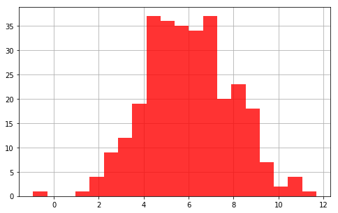
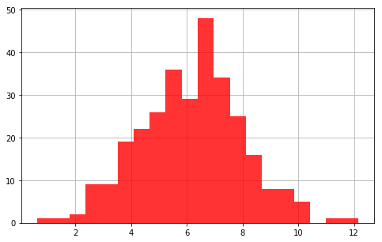
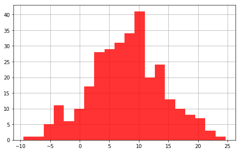

### Questions

### Objectives
YWBAT 
* apply best practices for hypothesis testing on data

### Outline


```python
import pandas as pd
import numpy as np

import scipy.stats as scs
import statsmodels.api as sm

import matplotlib.pyplot as plt
```


```python
# How do I setup a hypothesis test? 
 
pop1 = np.random.normal(loc=np.random.randint(5, 8), scale=np.random.randint(2, 3), size=300)
pop2 = np.random.normal(loc=np.random.randint(5, 8), scale=np.random.randint(2, 3), size=300)
pop3 = np.random.normal(loc=np.random.randint(5, 10), scale=np.random.randint(5, 8), size=300)
```

### Workflow
* **State A Question - Not the Same as a Hypothesis**
    * Do discounts have a statistically significant on the amount of products purchased
* **Split up your populations**
    * Scenario A: Split up population by discount amount
    * Scenario B: Split up discount vs no discount
    * Scenario C: Split up discounts under 10%, discounts = 15%, discounts over 15%
* **Form your hypothesis**
    * Scenario A:
        * H0: $\mu_1 = \mu_2 = ... = \mu_k$
        * HA: $\mu_1 \neq \mu_2 \neq \mu_3 ... \neq \mu_k$l
    * Scenario B:
        * H0: $\mu_1 = \mu_2$ 
        * HA: $\mu_1 \neq \mu_2$
    * Scenario C:
        * H0: $\mu_1 = \mu_2 = ... = \mu_k$
        * HA: $\mu_1 \neq \mu_2 \neq \mu_3 ... \neq \mu_k$
* **Investigate/EDA**
* **Determine which Test to Use**
    * A good sample size is around 30
    * Test Normality: **Shapiro Test**
    * Test Equal Variance: 
        * 2 populations **Levene Test**
        * 2+ populations **Bartlett Test**
        
    * Scenario A:
        * ANOVA
            * check for normality
            * check for equal variances
            * Anova just says 1 thing is different
        * Tukey
            * Pairwise comparisons
    * Scenario B:
        * 2samplettest
            * Welch's
                * nonequal variance
                * normally distributed population
                * Use when sample size isn't the same
            * Not Welch's
                * equal variance
                * normally distributed population
                * sample sizes have to be similar
            * 2 tailed
    * Scenario C:
        * ANOVA
            * check for normality
            * check for equal variances 
            * Anova just says 1 thing is different
        * Tukey
            * Pairwise comparisons
* **Run Your Test**
* **Interpret Results**
* **Business Recommendations**
* **Possibly investigate further, if not suggest further work**


```python
# Run Shapiro Test (Test for Normality on our pops)
for pop in [pop1, pop2, pop3]:
    w, p = scs.shapiro(pop)
    print("p = {}".format(p))
```

    p = 0.814402163028717
    p = 0.8968263268470764
    p = 0.7062969207763672


```python
arr = [[p, 1] for p in pop1]
arr.extend([[p, 2] for p in pop2])
arr.extend([[p, 3] for p in pop2])
```


```python
arr = np.array(arr)
df = pd.DataFrame(data=arr, columns=['num', 'group'])
df["group"] = df["group"].astype(int)
df.head()
```


<div>
<style scoped>
    .dataframe tbody tr th:only-of-type {
        vertical-align: middle;
    }

    .dataframe tbody tr th {
        vertical-align: top;
    }

    .dataframe thead th {
        text-align: right;
    }
</style>
<table border="1" class="dataframe">
  <thead>
    <tr style="text-align: right;">
      <th></th>
      <th>num</th>
      <th>group</th>
    </tr>
  </thead>
  <tbody>
    <tr>
      <th>0</th>
      <td>5.037819</td>
      <td>1</td>
    </tr>
    <tr>
      <th>1</th>
      <td>3.336897</td>
      <td>1</td>
    </tr>
    <tr>
      <th>2</th>
      <td>1.837631</td>
      <td>1</td>
    </tr>
    <tr>
      <th>3</th>
      <td>8.614991</td>
      <td>1</td>
    </tr>
    <tr>
      <th>4</th>
      <td>3.200012</td>
      <td>1</td>
    </tr>
  </tbody>
</table>
</div>


```python
sm.stats.multicomp.pairwise_tukeyhsd(df, groups='group')
```


    ---------------------------------------------------------------------------

    ValueError                                Traceback (most recent call last)

    <ipython-input-48-af1e7fcd05a5> in <module>
    ----> 1 sm.stats.multicomp.pairwise_tukeyhsd(df, groups='group')
    

    /anaconda3/lib/python3.7/site-packages/statsmodels/stats/multicomp.py in pairwise_tukeyhsd(endog, groups, alpha)
         36     '''
         37 
    ---> 38     return MultiComparison(endog, groups).tukeyhsd(alpha=alpha)
    

    /anaconda3/lib/python3.7/site-packages/statsmodels/sandbox/stats/multicomp.py in __init__(self, data, groups, group_order)
        787 
        788         if len(data) != len(groups):
    --> 789             raise ValueError('data has %d elements and groups has %d' % (len(data), len(groups)))
        790         self.data = np.asarray(data)
        791         self.groups = groups = np.asarray(groups)


    ValueError: data has 900 elements and groups has 5


# Does population have an effect on the mean?

# Step 0: Investigate


```python
def make_dist(arr, bins=20, color='r', alpha=0.8):
    plt.figure(figsize=(8, 5))
    plt.grid(zorder=0)
    plt.hist(arr, bins=bins, color=color, alpha=alpha, zorder=2)
    plt.show()
```


```python
make_dist(pop1)
make_dist(pop2)
make_dist(pop3)
```











```python
pop1.mean(), pop2.mean()
```


    (6.7822610289145535, 5.921375992970874)


# Step 1: State Hypothesis

**In the project, an example would be, 

H0: $\mu_1 = \mu_2$

HA: 

### Assessment
