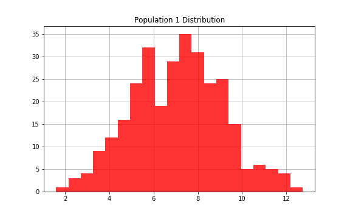

# Introduction

# Question 1
Does population 1 have a different mean that population 2?
### Investigation

### Hypothesis Test Results
H0: mu1 = mu2
HA: mu1 != mu2

pvalue = 0.0232 which indicates we can reject our null hypothesis.
### Conclusion
### Further Analysis